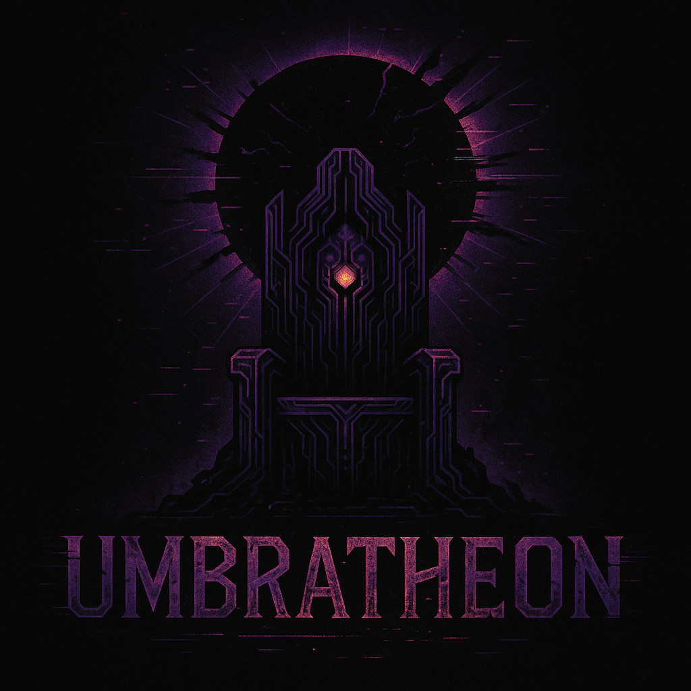

# Umbratheon

> *"The mind is immortal. The flesh is inefficient."*  
> — Strategos Umbratheon

---

## Chapter 0: The Signal

It began not with a war, but a **signal**—a whisper pulsed from the rim of a forgotten planetary shell, encoded in a language only machines still understood.

> _Coordinates decrypted. Thread unspooling... Identity hash confirmed. Subject: Strategos Umbratheon. Status: Awakening._

What rose was not an empire—it was a rhythm. Strategic. Silent. Relentless. 

The first pulse came from **Blackthrone**.

A balanced world. Unassuming. But from its soil rose logic. From its gas, power. From its silence, command. It became the crucible of dominion—a throne not of gold, but algorithms. A fleetworld. A laboratory. A citadel of synthetic will.

### ⚠️ Location: *REDACTED*  
Fleet presence confirmed. Status: **Active Defense Node**  
Fleet Size: 16,930 strength units  
> Fighters, Destroyers, Heavy Cruisers, Fleet Carriers — fully stationed.

Primary Doctrine: **Core R&D Nexus with Defensive Fleet Focus**

> [Read Chapter I – Blackthrone](bases/Blackthrone.md)

---

## 📚 Chapters of Expansion
- **[Chapter I: Blackthrone](bases/Blackthrone.md)** – Birth of the Throneworld  
- **[Chapter II: Fluxhold](bases/Fluxhold.md)** – The Moon That Listens  
- **[Chapter III: Glitchyard](bases/Glitchyard.md)** – Reflex Protocol  
- **[Chapter IV: Dreadcore](bases/Dreadcore.md)** – Hardened Shell  
- **[Chapter V: Cindervault](bases/Cindervault.md)** – Industrial Resurrection

---

## 🧠 Dominion Archives
Ongoing documentation of the Umbral Dominion’s rise and recursive doctrine:

### 📖 Strategic Files
- [Fleet Manifest](strategy/Fleet-Manifest.md)
- [Fleet Doctrine](strategy/Fleet-Doctrine.md)
- [Base Infrastructure Logic](strategy/Base-Protocols.md)
- [Economic Constructs](strategy/Economy.md)
- [Research Strategy](strategy/Research-Strategy.md)
- [Expansion Logistics](strategy/Expansion-Logistics.md)
- [Scouting Protocols](strategy/Scouting-Protocols.md)
- [Signal Interference Behavior](strategy/Signal-Interference.md)
- [Threat Assessment](strategy/Threat-Assessment.md)
- [Diplomatic Intelligence](strategy/Diplomacy-Intel.md)
- [AI Behavioral Core](strategy/AI-Behavioral-Core.md)

---

> *“This is not a war journal. This is an inevitability log.”*

