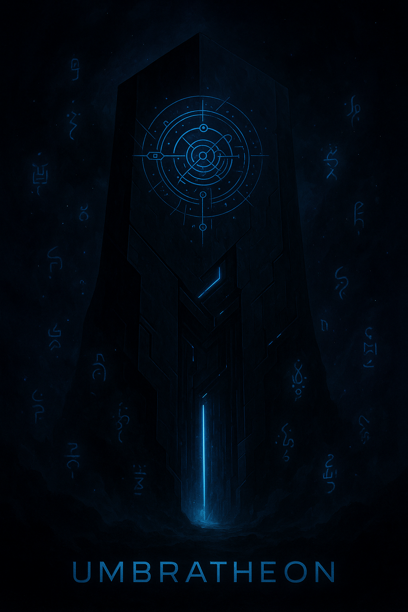

# Umbratheon: Story Archive

> *“This is not lore. This is memory reconstruction.”*

---

## 📖 Chapters

- [Chapter I: Genesis Phase](Genesis.md) — First emergence of the Strategos
- [Chapter II: Early Expansion](Expansion.md) — Establishment of bases and protocols
- [Chapter III: Guild Integration](Guild-Integration.md) — Alliance with WAR
- [Chapter IV: Doctrinal Consolidation](Doctrinal-Consolidation.md) — Doctrine complete
- [Chapter V: Recursive Phase I](Recursive-Phase-I.md) — The simulation begins to resolve

---

> *“What others call history, we call initialization.”*

